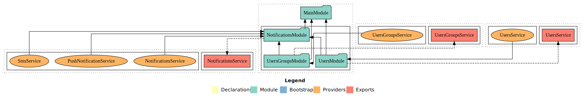
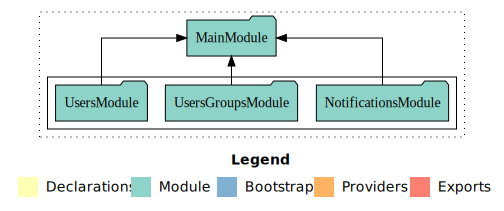
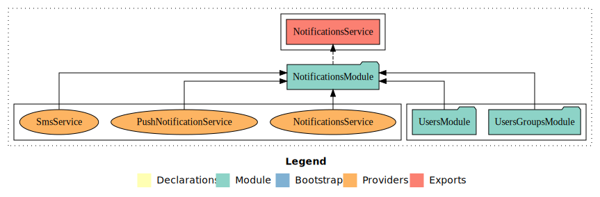
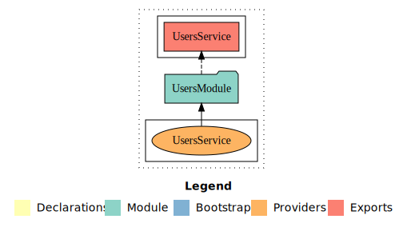
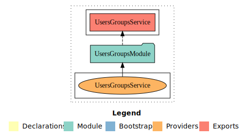

# Notifications service

## Description

#### Case: Marketplace Tribe

```text
In Swvl, we communicate with our customers via different types of notifications (e.g we send promo codes to customers via SMS, send in-ride push notifications like “Your drop-off station is coming”). And each customer receives a notification in their preferred language.

## Specifications
  ● Notifications Types are as follows:
    ○ Group notifications are sent as a text notification to a group of users.
    ○ Personalized notifications are sent as a specific text notification to a specific user.
  ● Notification can be delivered by two types of providers:
    ○ SMS
    ○ Push notifications
  ● The number of requests that providers (SMS, Push notifications) can handle per minute is limited.

## Requirements
  ● Implement the notification service.
  ● Write units tests to test your service the more coverage the better
  ● Service should be run by docker-compose up.
  ● Documentation:
    ○ A simple diagram of the architecture.
    ○ How to run it.
    ○ How another microservice would contact this service to send a notification.
    ○ Future improvements
Use Nodejs / Python / GoLang / Java for your implementation.
```

## Architecture

### Whole app architecture

<p align="center">
  
</p>

### Main module architecture

<p align="center">
  
</p>

### Notification module architecture

<p align="center">
  
</p>

### User module architecture

<p align="center">
  
</p>

### User group module architecture

<p align="center">
  
</p>

## Chosen technologies

- Nest.js
  : Node.js framework using TypeScript based on some "angular/core" packages
- Message broker
  : for handle all notifications requests with asynchronous, let only one service will be consumed and acknowledge receiving the message sent message
- RabbitMQ
  : Load-balancer (Round robin) between the messages for consumers of "notification queue"
- Docker
  : facilitate install, start and deploy apps via isolated container, and its dependence systems
- Docker compose
  : scale the service and instantiate

# Requirement

- Install Node.js v12+
- Install Docker & Docker-compose
- Install Erlang, Rabbit-MQ (optional if you are not going to use docker-compose containers)

# How to start

### Running on Docker

```bash
# Docker
$ docker-compose up -d
```

### Running on local development

- After install Node.js, Erlang, Rabbit-MQ

```bash
# Local development
$ npm install

# development
$ npm run start

# watch mode
$ npm run start:dev
```

### Test application

```bash
# Run unit tests
$ npm run test

# Run coverage tests
$ npm run test:cov
```

# How to connect

## Publish messages to Message broker at "notification" queue

## 1. Connect via Message broker management dashboard (if you are not familiar with RabbitMQ)

- After running the containers "message-broker", and "notifications-service"
- Visit http://localhost:15672
- Use default broker auth (username: 'guest', password: 'guest')
- Open the "Queues" tab at the navbar, or using [Queues](http://localhost:15672/#/queues)
- Open "notifications" queue [Notification Queue](http://localhost:15672/#/queues/%2F/notifications)
- Scroll down to the "Publish message" section
- Copy one of the following messages examples

```javascript
//  Notification message should published
{
  "pattern": "an enum with allowed values ['sms', 'push-notification']",
  "data": {
    "deliveryType": "an enum with allowed values ['user', 'users-group']",
    "deliveryId": "a number of any id ['user', 'users-group'] exists",
    "message": {
      "ar": "any message context in Arabic",
      "en": "any message context in English"
    }
  }
}
```

```json
//  SMS message for a specific user with userId=1 .e.g
{
  "pattern": "sms",
  "data": {
    "deliveryType": "user",
    "deliveryId": 1,
    "message": {
      "ar": "Single user SMS message in Arabic",
      "en": "Single user SMS message in English"
    }
  }
}
```

```json
// SMS messages for users group with userGroupId=1 -> user [1, 2] .e.g
{
  "pattern": "sms",
  "data": {
    "deliveryType": "users-group",
    "deliveryId": 1,
    "message": {
      "ar": "Users group SMS message in Arabic",
      "en": "Users group SMS message in English"
    }
  }
}
```

```json
// Push notification for a specific user with userId=1 .e.g
{
  "pattern": "push-notification",
  "data": {
    "deliveryType": "user",
    "deliveryId": 1,
    "message": {
      "ar": "Single user push notification message in Arabic",
      "en": "Single user push notification message in English"
    }
  }
}
```

```json
// Push notification for users group with usersGroupId=1 -> users [1, 2] .e.g
{
  "pattern": "push-notification",
  "data": {
    "deliveryType": "users-group",
    "deliveryId": 1,
    "message": {
      "ar": "Users group push notification message in Arabic",
      "en": "Users group push notification message in English"
    }
  }
}
```

## 2. Connect via a client application

For example connect to notifications service from Node.js application

- Install micro-service, rabbitmq connector packages

```bash
$ npm i @nestjs/microservices amqplib amqp-connection-manager
```

#### Import and register our notification service proxy

```ts
import { ClientsModule, Transport } from "@nestjs/microservices";

@Module({
  imports: [
    ClientsModule.register([
      {
        name: "NOTIFICATIONS_SERVICE",
        transport: Transport.RMQ,
        options: {
          urls: ["amqp://localhost:5672"],
          queue: "notifications",
          queueOptions: {
            durable: false,
          },
        },
      },
    ]),
  ],
})
export class AppModule {}
```

#### Use register service and publish a message

- Inject client proxy in provider constructor
- send, or emit notification messages to our message broker
- Message broker will pass all messages one by one to "Notifications services"

```ts
import { ClientProxy } from "@nestjs/microservices";

@Injectable()
export class NotificationService {
  constructor(@Inject("NOTIFICATIONS_SERVICE") private client: ClientProxy) {}

  async sendSms(smsData: INotificationData): Promise<string[]> {
    return await this.client.send<string[]>("sms", smsData).toPromise();
  }

  async sendPushNotification(
    pushNotificationData: INotificationData
  ): Promise<string[]> {
    return await this.client
      .send<string[]>("push-notification", pushNotificationData)
      .toPromise();
  }
}
```

# Future improvements

- Implement more bushiness, and validation instead of just payload pipe-line validation
- Add email notification and mail message to notification module depend on bushiness needs
- Create push notification module that will have multi devices tokens
- Use event source with subscribers on (user, user-group) events; instead of (user, users-groups) mocks
- Mirror queuing to the message broker for High availability
- Integrate with a real push notification, sms services providers
- test cases and write more unit tests

## Stay in touch

- Repo Author - [Hisham Taha](https://www.linkedin.com/in/hisham-taha-kamal-al-din/)

## License

Nest is [MIT licensed](LICENSE).
